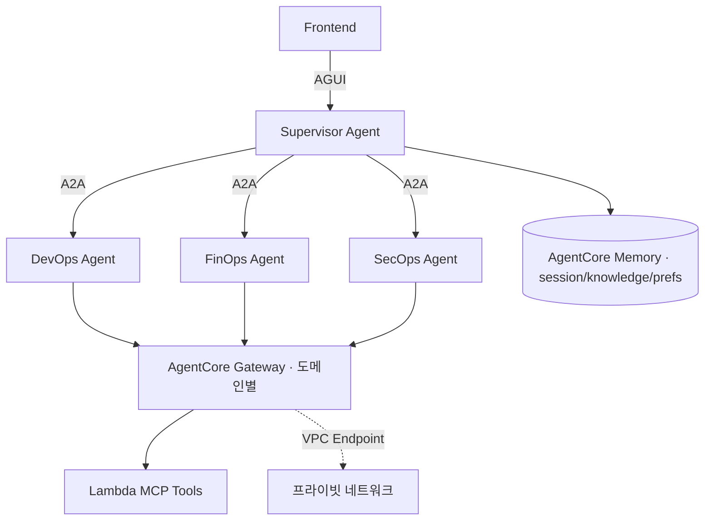

## 한 줄 요약

"의도는 Supervisor가 라우팅하고, 일은 도메인 에이전트가 나눠서 한다."

## 구성도

## 설계 원칙

1. **책임 분리** — 도메인(DevOps/FinOps/SecOps)별로 에이전트를 나누고, 세부는 서브에이전트로 더 쪼갠다.
2. **프로토콜 분리** — 에이전트 간은 A2A, 사용자-Supervisor는 AGUI로 경계를 명확히 한다.
3. **도구는 Gateway 뒤로** — Lambda MCP Tools를 Gateway로 묶고 VPC Endpoint로 프라이빗하게 통제한다.
4. **기억은 계층화** — session / knowledge / user_preferences로 Memory를 분리한다.

## 트레이드오프

- 멀티 에이전트는 책임 분리와 확장에 유리하지만, 라우팅·관측·디버깅 복잡도가 올라간다.
- 모델 비용은 작업 난이도별 멀티모델(Opus/Sonnet/Haiku) 선택으로 균형을 맞춘다.
