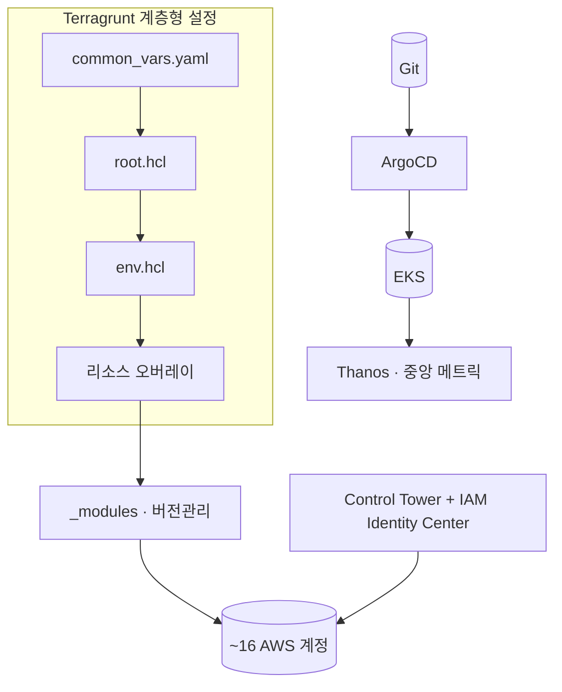

## 한 줄 요약

"계정은 Control Tower로 가드레일을 걸고, 인프라는 Terragrunt 계층으로, 상태는 Git으로 둔다."

## 구성도

## 설계 원칙

1. **격리는 계정으로** — 폭발 반경을 계정 경계로 제한한다.
2. **설정은 계층으로** — common → root → env → 오버레이로 중복 없이 차이만 흡수한다.
3. **거버넌스는 베이스라인으로** — Control Tower로 계정 생성 시점부터 가드레일을 적용한다.
4. **상태는 Git으로** — ArgoCD로 무엇이 떠 있어야 하는지를 Git에 고정하고 자동 롤백한다.

## 트레이드오프

- 계정 분리는 격리에 유리하지만 Cross-account IAM 설계 복잡도가 올라간다 — 읽기전용/읽기쓰기 역할 분리로 완화한다.
- 폐쇄망은 자동화를 어렵게 하지만, Helm 반입 자동화 프로세스를 설계하면 보안 제약 안에서도 GitOps를 유지할 수 있다.
