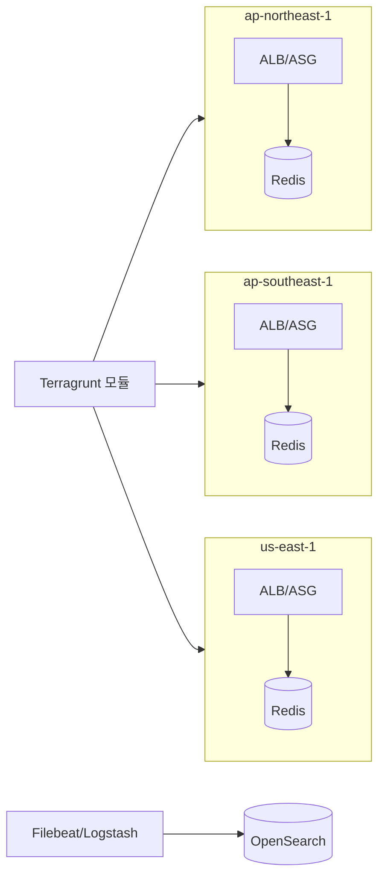

## 한 줄 요약

"리전은 Terragrunt로 복제하고, 장애는 로그가 먼저 말하게 한다."

## 구성도

## 설계 원칙

1. **리전은 코드로 복제** — Terragrunt로 리전별 차이를 변수로만 흡수, 신규 리전 확장을 빠르게.
2. **상태 계층은 가까이** — ElastiCache(Redis)로 세션/캐시 지연을 리전 내에서 흡수.
3. **장애는 관측이 먼저** — 실시간 로그 파이프라인으로 원인 파악 시간을 단축.

## 트레이드오프

- 멀티리전은 가용성·지연에 유리하지만 데이터 정합성과 운영 복잡도가 올라간다.
- 리전 전체 복제는 비용이 크므로, 트래픽이 검증된 리전만 단계적으로 확장하는 게 현실적이다.
