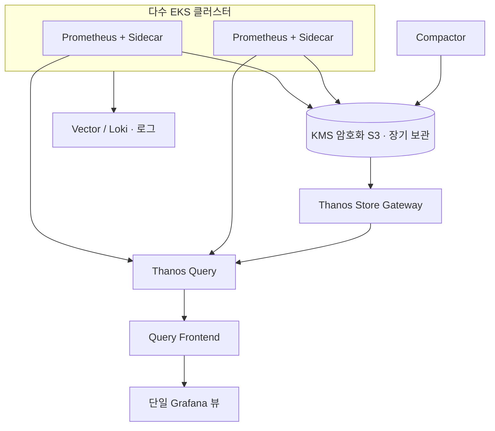

## 한 줄 요약

"클러스터는 흩어져 있어도, 메트릭은 하나의 뷰에서 본다."

## 구성도

## 설계 원칙

1. **수집은 분산, 조회는 단일** — 클러스터별 Prometheus 사이드카로 수집하고 Thanos Query로 한 뷰에서 조회한다.
2. **장기 보관은 오브젝트 스토리지로** — VPC Endpoint 경유 KMS 암호화 S3에 장기 메트릭을 둔다.
3. **크로스 클러스터는 NLB로** — LoadBalancer 기반으로 클러스터 간 쿼리를 지원한다.

## 트레이드오프

- 중앙 집중은 운영 가시성을 높이지만, Store/Compactor 등 컴포넌트가 늘어 운영 포인트가 많아진다.
- 장기 보관 비용은 다운샘플링·보존 정책으로 관리한다.
