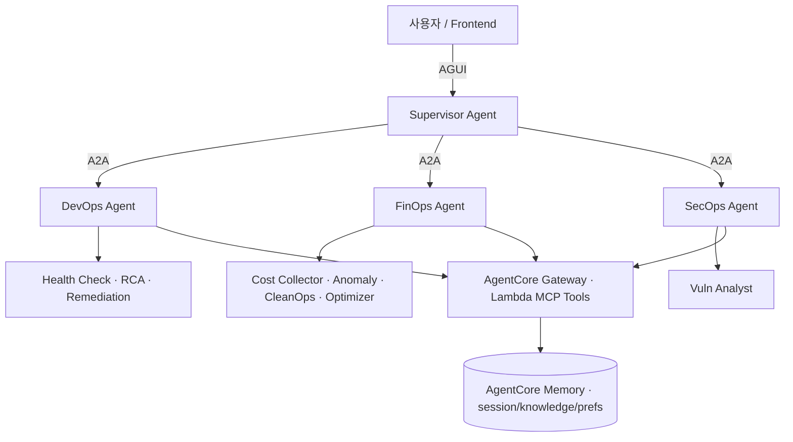

**문제**  멀티 클라우드 운영·비용·보안 점검이 사람마다 산발적으로 반복 → 통합 컨트롤 부재, 비기술 이해관계자는 현황 파악조차 어려움.

**접근**  단발 스크립트 대신 **도메인별 에이전트 + Supervisor 라우팅** 플랫폼으로 통합. AgentCore(Runtime·Gateway·Memory) 기반 계층형 에이전트를 직접 설계.

## 아키텍처

## 핵심 작업

- **계층형 에이전트 설계** — DevOps(Health Check·RCA·Remediation), FinOps(Cost·Anomaly·CleanOps·Optimizer), SecOps(Vuln Analyst), 의도 라우팅·결과 집약 Supervisor
- **프로토콜 분리** — 에이전트 간 A2A, 사용자–Supervisor AGUI
- **Gateway + MCP** — 도메인별 AgentCore Gateway에 Lambda MCP Tools 연결, VPC Endpoint 프라이빗 통제
- **FinOps 최적화 엔진** — K8s/EC2/RDS 실시간 사용량 × 권장 기준 결합, Over/Under 자원 가시화, RI/Savings Plan 분석, 멀티 계정 인보이스 대사
- **서비스 모듈(FastAPI+Flutter)** — K8s Optimizer, Athena CUR 빌링 분석, Idle Cleaner, NVD 2-Tier CVE, Daily Health 챗봇
- **모노레포 CI/CD** — 12 Runtime / 4 Gateway / 3 Memory + Backend/Batch/Frontend 독립 배포 (GitLab CI → ECR → Helm/ArgoCD, Cross-Account 3계정)
- **LLM Gateway·관측 계층** — 백엔드·에이전트·개발자 CLI의 모든 LLM 호출을 LiteLLM 단일 관문으로 수렴(virtual key 인증·예산·rate limit, 앱 재배포 없는 모델 alias 교체), Langfuse self-host 연동으로 앱 수정 없이 사용자 단위 프롬프트·토큰·지연·비용 trace → [인터랙티브 다이어그램](/architecture/llm-gateway)

## 성과

- **비기술 이해관계자도 자연어로** 인프라 현황 직접 파악
- **리소스 확인 셀프서비스화** — 챗봇이 실 인프라 현황 기반으로 응답(예: VPC 설계 시 미사용 CIDR 추천), 약 16개 계정을 일일이 조회하던 확인 작업과 수동 자산 대장 업데이트 대체
- **Context Engineering**으로 수백 개 리소스 상태를 핵심 인사이트로 자동 요약 → 분석 시간 대폭 단축
- Gateway 레벨 Prompt Caching 실측 **입력 토큰 88% 캐시 적용**(캐시 구간 요금 90% 절감), Langfuse userId 매핑으로 **사용자별 사용량·비용 추적** 체계 확립
- 멀티 계정 통합 인벤토리·유휴 자원 탐지 자동화, Jira·인보이스·빌링 리포트를 Slack에서 처리
