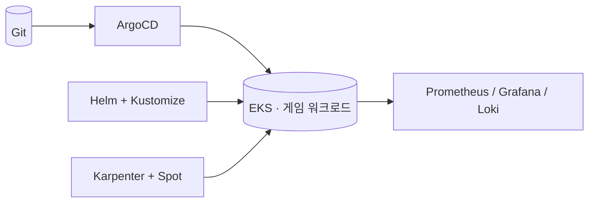

**문제**  신규 모바일 게임 런칭 → 트래픽 변동 크고, 출시 직후 안정성이 곧 평판. 기존 방식으론 확장과 배포 안정성 동시 확보 어려움.

**접근**  게임 워크로드 특성(피크 집중·빠른 확장)을 먼저 반영한 **확장 가능한 EKS 아키텍처 신규 설계**. 비용·탄력성은 Karpenter+Spot, 배포는 GitOps로 선제 설계.

## 아키텍처

## 핵심 작업

- **EKS 아키텍처 설계** — 게임 워크로드 특성 반영, 확장 가능한 구조
- **배포 자동화** — Helm Chart + Kustomize 멀티 클러스터 배포, HPA 워크로드 기반 자동 확장
- **비용 최적화** — Karpenter + Spot 인스턴스로 피크 외 자원 사용률 개선
- **GitOps & 관측** — ArgoCD 배포 체계, Prometheus/Grafana/Loki 통합 모니터링

## 성과

- 피크 외 자원 사용률 **20% 개선**
- 수동 배포 오류율 **80% 이상 감소**
- Kubernetes 기반 게임 서비스 안정적 런칭·운영
