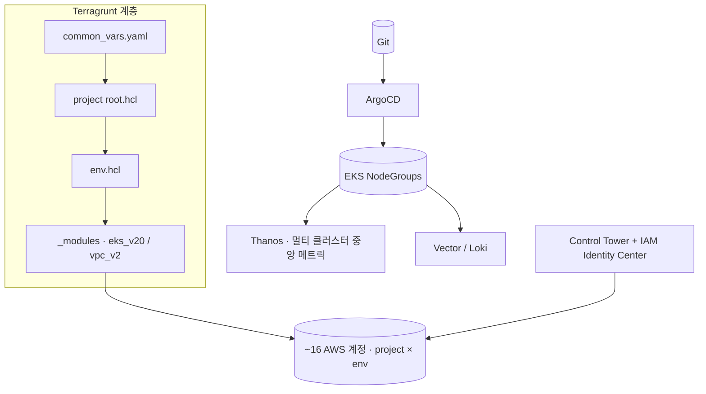

**문제**  3개 프로젝트 × dev/sdx/prd × 약 16개 계정 → 설정이 계정마다 흩어져 보안 리스크·운영 부담 동시 증가, 폐쇄망 제약까지 중첩.

**접근**  인프라를 **계층형 코드(Terragrunt)** 로 정의하고 배포는 **Git 단일 소스(ArgoCD)** 로 수렴. 거버넌스는 Control Tower로 계정 생성 시점부터 가드레일.

## 아키텍처

## 핵심 작업

- **멀티 계정 IaC** — Terragrunt로 ~16개 계정 코드화, 공유 모듈(`_modules`, 버전관리), 계층형 설정(common→root→env→오버레이), 백엔드 부트스트랩(S3+DynamoDB+IAM) 자동화
- **Kubernetes 플랫폼** — 역할 분리 NodeGroup(controller/app/monitoring), Karpenter NodePool, Helm 통합 차트, HPA/PDB/NetworkPolicy
- **접근 제어** — Control Tower + IAM Identity Center + Azure AD, Cross-account 역할 분리(읽기전용/읽기쓰기), `local_plan` 안전 운영, KMS 전사 암호화
- **재사용 CI/CD** — 브랜치명 기반 환경 자동 감지(feature→dev / release→sdx / main→prd), 폐쇄망 Helm 반입 자동화, ArgoCD 자동 롤백
- **통합 관측** — Thanos(Query/Store/Compactor/QF) 중앙 집중, KMS 암호화 S3 장기 보관, 단일 Grafana 뷰, Vector/Loki 로그

## 성과

- 멀티 계정·리전 관리 복잡도 **50% 감소**
- 수동 배포 오류율 **80% 이상 감소**
- 폐쇄망에서도 자동 배포 달성, 신규 프로젝트 온보딩 시간 단축, 통합 인증(SSO) 체계 확립
