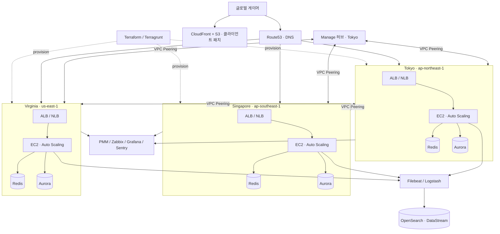

**문제**  국내 런칭 후 글로벌 확장 → 지연·가용성 동시 확보 필요. 라이브 장애 시 로그 분산으로 원인 파악 지연.

**접근**  매번 새로 만들지 않도록 **IaC로 구성 표준화·재사용**. 글로벌은 멀티리전, 장애 대응은 실시간 로그 분석으로 구조 선제 설계.

## 아키텍처

## 핵심 작업

- **글로벌 아키텍처** — Route53 DNS 진입 → ALB/NLB → EC2 Auto Scaling 게임 서버 → Aurora·Redis 데이터 계층, VPC(NAT/IGW·다중 서브넷·SG)까지 고가용성 설계. 국내 런칭 후 도쿄·싱가포르·버지니아 멀티리전 확장
- **VPC Peering 메시** — Tokyo의 **Manage 허브**가 모든 리전·QA(서울)와 Peering하고 Tokyo↔Singapore·Virginia를 추가 연결해 글로벌 사설 통신 확보
- **IaC 표준화** — Terraform + Terragrunt로 `region.hcl`/`env.hcl` + `_envcommon` 계층화, VPC·ALB·ASG·RDS(Aurora)·Redis·CloudFront 모듈을 리전 변수만 바꿔 재사용
- **실시간 로그 파이프라인** — OpenSearch + Filebeat + Logstash, DataStream 전환, Logstash 최적화, 인덱스 튜닝(40~50GB)
- **배포·모니터링** — GitLab CI/Jenkins, CloudFront+S3 클라이언트 패치 + 메신저 알림, PMM/Zabbix/Grafana/Sentry 다층 모니터링

## 성과

- 장애 대응 시간 **30% 단축**
- 로그 수집 속도 **50% 향상**, 처리 속도 **30% 개선**
- 국내·글로벌 서비스 안정적 런칭·장기 운영
