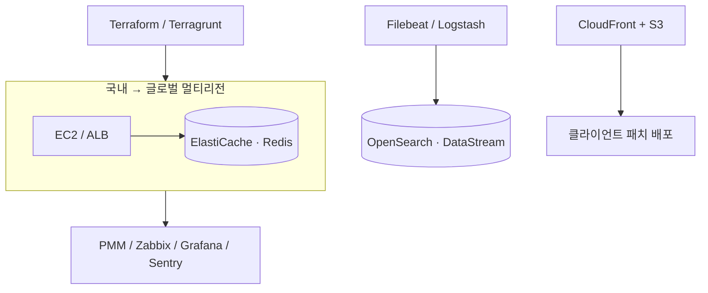

**문제**  국내 런칭 후 글로벌 확장 → 지연·가용성 동시 확보 필요. 라이브 장애 시 로그 분산으로 원인 파악 지연.

**접근**  매번 새로 만들지 않도록 **IaC로 구성 표준화·재사용**. 글로벌은 멀티리전, 장애 대응은 실시간 로그 분석으로 구조 선제 설계.

## 아키텍처

## 핵심 작업

- **글로벌 아키텍처** — 고가용성·확장성 고려 AWS 설계, 국내 런칭 후 멀티리전 확장
- **IaC 표준화** — Terraform + Terragrunt로 구성 표준화·재사용성 확보
- **실시간 로그 파이프라인** — OpenSearch + Filebeat + Logstash, DataStream 전환, Logstash 최적화, 인덱스 튜닝(40~50GB)
- **배포·모니터링** — GitLab CI/Jenkins, CloudFront+S3 클라이언트 패치 + 메신저 알림, PMM/Zabbix/Grafana/Sentry 다층 모니터링

## 성과

- 장애 대응 시간 **30% 단축**
- 로그 수집 속도 **50% 향상**, 처리 속도 **30% 개선**
- 국내·글로벌 서비스 안정적 런칭·장기 운영
